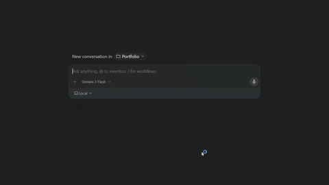

<div align="center">
  
  <h1>antiflow</h1>
  <p><b>"Vibecoding is a skill issue. Antiflow is the fix."</b></p>
  <br />
  <a href="https://github.com/ilyasstrougouty/antiflow/stargazers"></a>
  <a href="https://github.com/ilyasstrougouty/antiflow"></a>
  <a href="https://github.com/ilyasstrougouty/antiflow/blob/main/LICENSE"></a>
  <br /><br />
</div>

<div align="center">
  <i>"<b>Vibe coding is making developers lazy.</b> Coding isn't supposed to be like watching youtube, it's supposed to be like building a masterpiece, brick by brick. Antiflow does the boring stuff, refuses to write all the logic, and hands you the tasks that matter. It protects your skills from rotting. Take the wheel back."</i>
</div>

<br />

<br />

<br />

<div align="center">
  
</div>

---

## 🛑 The Core Protocol

Antiflow is an AI coding protocol. It acts as your **AI Tech Lead**. 
It writes the basic setup. It configures your environment. It **refuses** to write your core logic.

## ⚙️ How It Works

1. **Intake**. You provide your role, level, and AI assistance ratio.
2. **Building Phase**. Antiflow builds the project structure (folders, settings, and basic code).
3. **Blocking Phase**. The core features you need to build are left as blank placeholders: `// TODO: [USER]`.
4. **Tickets**. Antiflow gathers all your placeholders into a `TODO.md` file.

## ❓ Why Antiflow?

AI coding assistants are getting better at writing code. That's the problem.

| Without Antiflow | With Antiflow |
|---|---|
| AI writes everything. You review. | AI builds the skeleton. You build the logic. |
| You forget how to think through problems. | You stay sharp on what matters. |
| The codebase is the AI's - you just deploy it. | The logic is yours - you own it. |
| "I'll just ask the AI" becomes your default. | The hard problems stay on your plate. |

Antiflow protects your coding skills.

## ✨ Key Features

- **🛡️ State Persistence**: Antiflow saves your configuration in `.antiflow.json`. Start a new chat, and it instantly remembers your role and project context.
- **📈 Skill Retention Score**: Get a "Sweat Equity" summary at the end of your session. Track how much domain logic you wrote vs. the AI.
- **🎓 Student Mode**: A Socratic tutoring mode where the AI refuses to give code answers and instead provides documentation and leading questions.
- **🧪 Test-Driven Validation (Optional)**: Toggle TDD mode on, and the AI will write the automated tests for your placeholders. Pass the tests, pass the task.
- **🔍 Token-Efficient Reviews**: When asking the AI to review your work, it is strictly instructed to only analyze your `git diff` rather than re-reading entire files, drastically saving context tokens.
- **📋 Ticket-Driven Development**: All AI-refused logic is automatically centralized into a `TODO.md` file with file paths and line numbers.


## 🚀 Usage

### 1. Installation
Pick your agent and run the corresponding command in your terminal. This will install the `SKILL.md` file into your agent's correct directory.

| Agent | Install |
| --- | --- |
| **Claude Code** | `npx skills add ilyasstrougouty/antiflow -a claude-code` |
| **Google Antigravity** | `npx skills add ilyasstrougouty/antiflow -a antigravity` |
| **Gemini CLI** | `gemini extensions install https://github.com/ilyasstrougouty/antiflow` |
| **Cursor** | `npx skills add ilyasstrougouty/antiflow -a cursor` |
| **Windsurf** | `npx skills add ilyasstrougouty/antiflow -a windsurf` |
| **Copilot** | `npx skills add ilyasstrougouty/antiflow -a github-copilot` |
| **Cline** | `npx skills add ilyasstrougouty/antiflow -a cline` |
| **Any other** | `npx skills add ilyasstrougouty/antiflow` |

### 2. Activation
Once installed, open your AI agent and start a new chat by saying:
> **"Activate the Antiflow protocol."**

### 3. Configuration
The AI will intercept your request and ask for the following parameters before it writes any code:

| Parameter | Options | Default | Description |
|-----------|---------|---------|-------------|
| `ROLE` | `Backend` / `Frontend` / `Mobile` / `Data` / `Security` | **Required** | Defines the domain logic to protect. |
| `LEVEL` | `student` / `junior` / `mid` / `senior` | **Required** | Calibrates task difficulty and hint depth. |
| `PROJECT` | *String* | **Required** | Brief description of the project. |
| `STACK` | *String* / `no preference` | Inferred | Target language or framework. |
| `AI_ASSISTANCE` | `0–100%` (any value, e.g. `30%`) | `0%` | Ratio of domain logic the AI will write. |
| `TEST_DRIVEN` | `true` / `false` | `false` | If true, AI writes functional tests for your stubs so you can verify locally. |

Once configured, Antiflow will save an `.antiflow.json` file in your project root so it remembers your settings across new chat sessions.

### 4. Build
The AI will set up the project, generate a `TODO.md` file, and assign the core business logic to **you**. If you try to ask the AI to complete your assigned tickets, it will refuse.

### 5. Updating
To update Antiflow to the latest protocol version, simply run the installation command again. This will fetch the latest directives and overwrite your existing `SKILL.md`.

```bash
npx skills add ilyasstrougouty/antiflow -a <your-agent>
```

---
**Get ready to write some code.**
